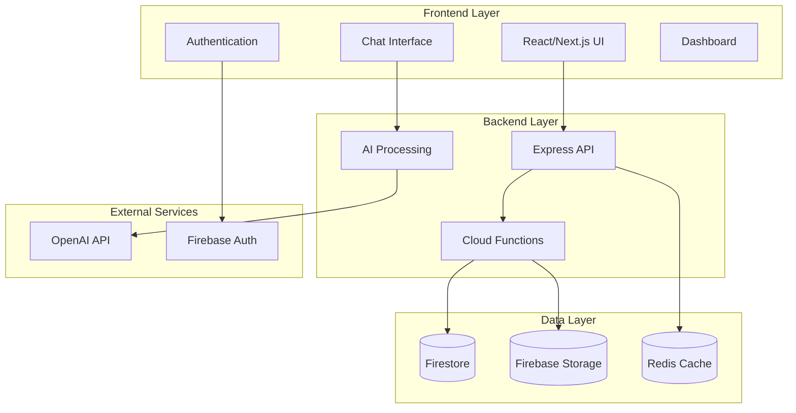
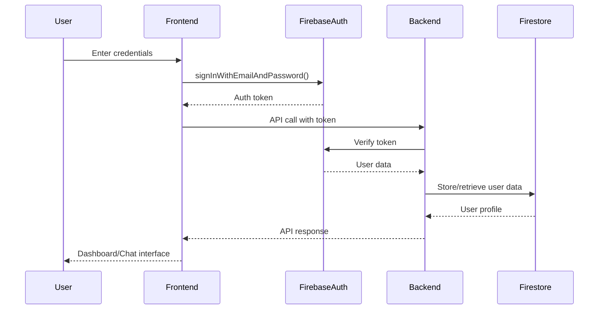
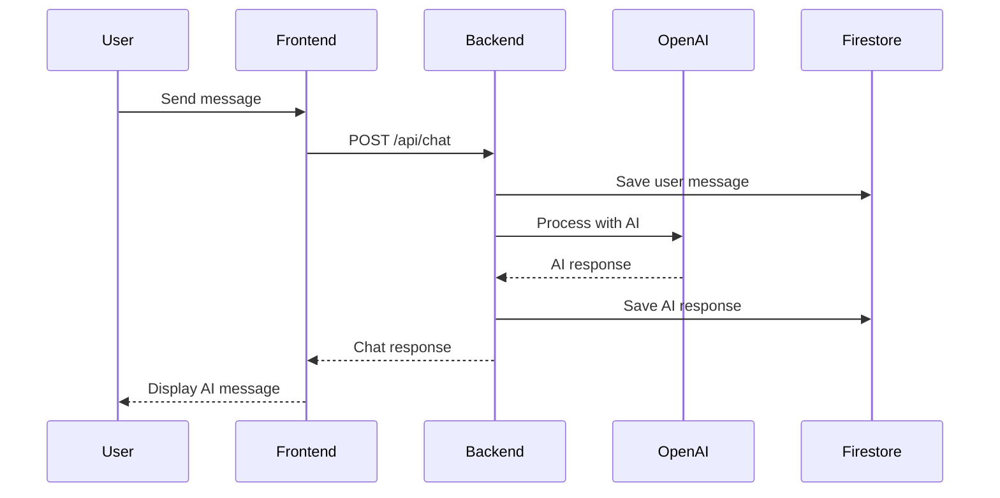
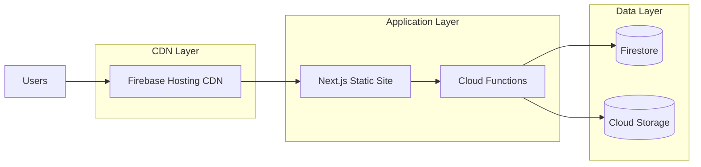

# 🏗️ Academico-AI Architecture Documentation

## 🎯 **System Overview**

Academico-AI is a modern, scalable AI-powered academic platform built with a microservices architecture and modern web technologies.

## 🧩 **Architecture Diagram**



## 🛠️ **Technology Stack**

### Frontend

- **Framework**: Next.js 14 (React 18)
- **Language**: TypeScript
- **Styling**: Tailwind CSS
- **State Management**: React Context + Hooks
- **Authentication**: Firebase Auth
- **Testing**: Jest + React Testing Library + Playwright

### Backend

- **Runtime**: Node.js 20
- **Framework**: Express.js
- **Platform**: Firebase Cloud Functions
- **Language**: TypeScript
- **API**: RESTful with Express Router

### Database & Storage

- **Primary Database**: Google Firestore (NoSQL)
- **File Storage**: Firebase Storage
- **Caching**: Redis (for session management)
- **Real-time**: Firestore real-time listeners

### Infrastructure

- **Hosting**: Firebase Hosting
- **Functions**: Firebase Cloud Functions
- **CI/CD**: GitHub Actions
- **Monitoring**: Firebase Analytics
- **Testing**: Comprehensive test suite with Playwright

## 📂 **Project Structure**

```
academico-ai/
├── frontend/                   # Next.js Frontend Application
│   ├── src/
│   │   ├── app/               # Next.js 13+ App Router
│   │   │   ├── page.tsx       # Homepage
│   │   │   ├── layout.tsx     # Root layout
│   │   │   ├── academic-chat/ # Chat feature pages
│   │   │   ├── sign-in/       # Authentication pages
│   │   │   └── sign-up/
│   │   ├── components/        # Reusable UI Components
│   │   │   ├── ui/           # Base UI components
│   │   │   ├── chat/         # Chat-specific components
│   │   │   └── auth/         # Authentication components
│   │   ├── contexts/          # React Context Providers
│   │   │   └── AuthContext.tsx
│   │   ├── hooks/             # Custom React Hooks
│   │   ├── lib/               # Utilities & Configuration
│   │   │   ├── firebase.ts    # Firebase configuration
│   │   │   └── utils.ts       # Utility functions
│   │   ├── services/          # API Service Layer
│   │   ├── types/             # TypeScript type definitions
│   │   └── utils/             # Helper functions
│   ├── public/                # Static assets
│   ├── package.json           # Frontend dependencies
│   └── next.config.js         # Next.js configuration
├── backend/                    # Backend Services
│   └── functions/             # Firebase Cloud Functions
│       ├── src/
│       │   ├── index.ts       # Main API entry point
│       │   ├── routes/        # API route handlers
│       │   ├── middleware/    # Express middleware
│       │   ├── services/      # Business logic
│       │   └── utils/         # Backend utilities
│       ├── package.json       # Backend dependencies
│       └── tsconfig.json      # TypeScript config
├── tests/                      # Comprehensive Test Suite
│   ├── e2e/                   # End-to-end tests (Playwright)
│   ├── integration/           # Integration tests
│   ├── unit/                  # Unit tests
│   ├── performance/           # Performance tests
│   ├── accessibility/         # A11y tests
│   └── config/                # Test configurations
├── docs/                       # Documentation
├── scripts/                    # Development & deployment scripts
├── firebase.json              # Firebase project configuration
└── package.json               # Root-level scripts & dependencies
```

## 🔄 **Data Flow**

### Authentication Flow



### Chat/AI Interaction Flow



## 🔧 **Key Components**

### Frontend Components

#### Authentication System

- **AuthContext**: Global authentication state management
- **ProtectedRoute**: Route protection wrapper
- **SignIn/SignUp**: Authentication UI components

#### Chat System

- **ChatInterface**: Main chat UI component
- **MessageList**: Display conversation history
- **MessageInput**: User input component
- **AIResponse**: AI message display

#### Layout & Navigation

- **Layout**: Root application layout
- **Navigation**: Main navigation component
- **Dashboard**: User dashboard interface

### Backend Services

#### API Layer

- **Express Router**: RESTful API endpoints
- **Authentication Middleware**: Token verification
- **CORS Configuration**: Cross-origin request handling

#### Business Logic

- **Chat Service**: Handle chat operations
- **User Service**: User management operations
- **AI Service**: OpenAI integration

#### Data Access Layer

- **Firestore Services**: Database operations
- **Storage Services**: File upload/download

## 📊 **Database Schema**

### Firestore Collections

```typescript
// Users Collection
users: {
  [userId]: {
    email: string;
    displayName: string;
    role: 'student' | 'teacher' | 'admin';
    createdAt: Timestamp;
    lastLogin: Timestamp;
    profile: {
      avatar?: string;
      bio?: string;
      interests?: string[];
    }
  }
}

// Chats Collection
chats: {
  [chatId]: {
    userId: string;
    title: string;
    createdAt: Timestamp;
    updatedAt: Timestamp;
    messages: Message[];
  }
}

// Messages Subcollection
messages: {
  [messageId]: {
    chatId: string;
    content: string;
    role: 'user' | 'assistant';
    timestamp: Timestamp;
    metadata?: {
      tokenCount?: number;
      model?: string;
    }
  }
}
```

## 🔒 **Security Architecture**

### Authentication & Authorization

- **Firebase Authentication**: Secure user authentication
- **JWT Tokens**: Stateless authentication for API calls
- **Role-Based Access Control (RBAC)**: User permissions system
- **Protected Routes**: Frontend route protection

### Data Security

- **Firestore Security Rules**: Database-level access control
- **HTTPS Only**: All traffic encrypted in transit
- **Environment Variables**: Secure credential management
- **Input Validation**: Server-side validation for all inputs

### API Security

- **CORS Configuration**: Controlled cross-origin access
- **Rate Limiting**: Prevent API abuse
- **Token Verification**: All API calls require valid authentication
- **Input Sanitization**: Prevent injection attacks

## 🚀 **Deployment Architecture**

### Production Environment



### CI/CD Pipeline

1. **Code Push**: Developer pushes to GitHub
2. **Automated Testing**: Jest + Playwright tests run
3. **Build Process**: Next.js static build + Functions build
4. **Deployment**: Firebase Hosting + Cloud Functions deployment
5. **Monitoring**: Firebase Analytics + Error tracking

## 📈 **Scalability Considerations**

### Frontend Scalability

- **Static Site Generation**: Fast loading with Next.js SSG
- **Code Splitting**: Automatic bundle optimization
- **CDN Distribution**: Global content delivery
- **Progressive Web App**: Offline-first capabilities

### Backend Scalability

- **Serverless Functions**: Auto-scaling cloud functions
- **NoSQL Database**: Horizontal scaling with Firestore
- **Caching Strategy**: Redis for session and response caching
- **Load Balancing**: Automatic with Firebase infrastructure

### Performance Optimization

- **Lazy Loading**: Components and routes
- **Image Optimization**: Next.js automatic optimization
- **Bundle Analysis**: Regular bundle size monitoring
- **Database Indexing**: Optimized Firestore queries

## 🔍 **Monitoring & Observability**

### Application Monitoring

- **Firebase Analytics**: User behavior tracking
- **Performance Monitoring**: Core Web Vitals tracking
- **Error Tracking**: Automated error reporting
- **Real-time Database Monitoring**: Firestore performance metrics

### Development Tools

- **Hot Reloading**: Fast development iteration
- **TypeScript**: Compile-time error checking
- **ESLint + Prettier**: Code quality enforcement
- **Comprehensive Testing**: Unit, integration, and E2E tests

---

**Related Documentation**:

- 🚀 [Deployment Guide](../deployment/production-deploy.md)
- 🧪 [Testing Strategy](../architecture/testing-decisions.md)
- 🔧 [API Reference](../api/endpoints.md)
- 📱 [Frontend Guide](frontend-guide.md)
